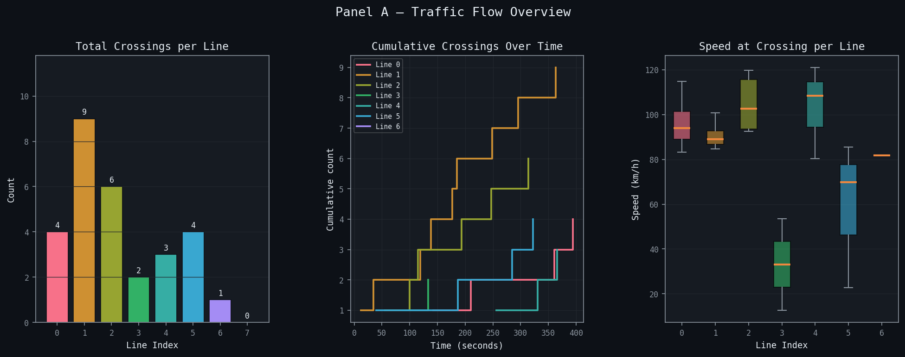
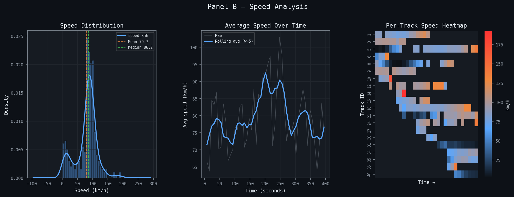
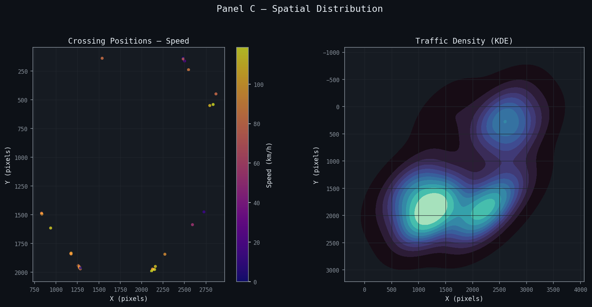
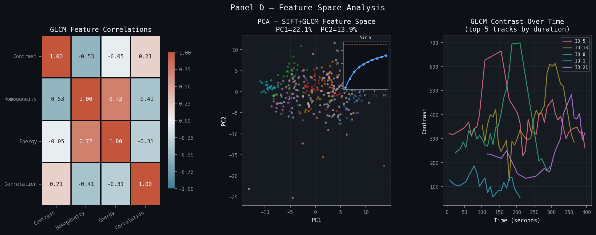
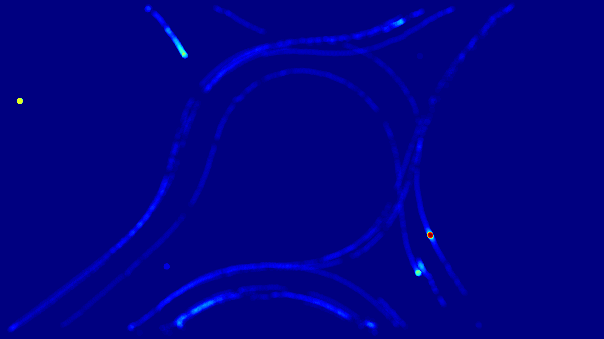

# Traffic Vision Analytics

A comprehensive traffic analysis system that uses YOLO-based vehicle detection and ByteTrack to monitor, track, and analyze vehicular traffic patterns from drone footage.

## Overview

This project processes drone video footage to extract detailed traffic metrics including:

- **Vehicle Detection & Tracking**: Real-time detection of cars, motorcycles, buses, and trucks using YOLOv8
- **Traffic Flow Analysis**: Count vehicles crossing predefined detection lines
- **Speed Estimation**: Calculate vehicle velocities using pixel-to-meter calibration
- **Spatial Heatmaps**: Visualize traffic concentration zones
- **Feature Extraction**: Deep feature analysis using SIFT descriptors and GLCM texture properties

## Key Features

🎯 **Advanced Tracking**

- ByteTrack multi-object tracking for consistent vehicle identification
- Track history buffer with configurable persistence
- Graph-cut refinement for improved detection quality

🔍 **Computer Vision Pipeline**

- Wavelet denoising for improved video quality
- SIFT feature extraction for vehicle characterization
- GLCM (Gray-Level Co-occurrence Matrix) texture analysis
- Configurable detection thresholds and matching parameters

📊 **Analytics Dashboard**

- Flow analysis panel showing traffic crossing counts
- Speed distribution visualization
- Spatial traffic concentration heatmaps
- Feature space dimensionality reduction (PCA)

## Project Structure

```
traffic-analysis/
├── infer.py                          # Main inference pipeline
├── visualize.py                      # Analytics dashboard generator
├── custom_tracker.yml                # ByteTrack configuration
├── assets/
│   └── drone-footage.mp4             # Input video file
├── models/
│   ├── yolo26m.pt                    # YOLOv8 Medium model
│   └── yolo26s.pt                    # YOLOv8 Small model
└── analysis/
    └── [session_id]/
        ├── annotated.mp4             # Output video with annotations
        ├── summary.json              # Analysis metadata
        ├── crossings.csv             # Line crossing events
        ├── speeds.csv                # Speed estimates
        ├── features.csv              # Extracted feature vectors
        ├── heatmap.png               # Traffic density heatmap
        └── plots/                    # Analysis visualizations
```

## Analysis Results

Latest analysis session: **20260506_230108**

### Statistics

| Metric | Value |
|--------|-------|
| Total Frames | 518 |
| Video Duration | 385.63s (~6.4 min) |
| Processing Speed | 1.34 fps |
| Spatial Calibration | 21.644 px/m |
| Unique Vehicles | 21 |

### Traffic Crossing Summary

| Line | Crossings |
|------|-----------|
| Line 0 | 1 |
| Line 1 | 1 |
| Line 2 | 1 |
| Line 3 | 3 |
| Line 4 | 3 |
| Line 5 | 4 |
| Line 6 | 0 (inactive) |
| Line 7 | 1 |
| Line 8 | 4 |
| Line 9 | 3 |
| **Total** | **21** |

## Analysis Visualizations

### Panel A: Traffic Flow Analysis



Cumulative vehicle counts crossing each detection line over time, revealing traffic patterns and flow intensity across different monitoring zones.

### Panel B: Speed Distribution



Distribution of vehicle speeds across the monitored area, showing average velocities and speed variations per detection line.

### Panel C: Spatial Traffic Concentration



Heatmap displaying traffic density and concentration patterns, revealing hotspots and traffic-prone areas within the monitored zone.

### Panel D: Feature Space Analysis



PCA projection of vehicle feature vectors (SIFT 128-dim + GLCM 4-dim) showing vehicle distribution in extracted feature space — useful for classification and anomaly detection.

### Heatmap Output



Raw accumulated heatmap saved per session at `analysis/[session_id]/heatmap.png`.

## Annotated Video

[](https://youtu.be/hle1LyJwCbQ?si=7KvIz4lzAMTgLQuQ)

Real-time vehicle detection, tracking IDs, speed labels, and line crossing annotations overlaid on the original drone footage.

## Usage

### Running the Inference Pipeline

1. **Place your video file** at `./assets/drone-footage.mp4`

2. **Run detection and tracking**:

   ```bash
   python infer.py
   ```

   Interactive setup prompts you to:
   - Draw counting lines on the first frame
   - Draw a calibration line over a known real-world distance
   - Enter the real-world length in meters

3. **Generate the analytics dashboard**:

   ```bash
   # Auto-detect latest session
   python visualize.py

   # Specify a session
   python visualize.py --session 20260506_230108

   # Save plots as PNG
   python visualize.py --session 20260506_230108 --save
   ```

### Configuration

Edit `custom_tracker.yml` to adjust tracking parameters:

```yaml
tracker_type: bytetrack
track_high_thresh: 0.5
track_low_thresh: 0.1
new_track_thresh: 0.6
track_buffer: 30
match_thresh: 0.8
fuse_score: True
gating_threshold: 0.8
```

Edit constants in `infer.py`:

```python
VIDEO_PATH      = "./assets/drone-footage.mp4"
MODEL_PATH      = "./models/yolo26m.pt"
VEHICLE_CLASSES = [2, 3, 5, 7]   # car, motorbike, bus, truck
TRACK_HISTORY   = 30
GRAPHCUT_EVERY  = 5
HEATMAP_RADIUS  = 20
```

## Output Files

| File | Description |
|------|-------------|
| `annotated.mp4` | Output video with bounding boxes, track IDs, speed labels |
| `summary.json` | Session metadata, calibration, per-line counts |
| `crossings.csv` | Per-event log: timestamp, frame, track ID, line index, coords, speed |
| `speeds.csv` | Speed estimates per vehicle per frame |
| `features.csv` | 132-dim feature vectors (128 SIFT + 4 GLCM) per vehicle |
| `heatmap.png` | Accumulated spatial density heatmap |
| `plots/` | Panel A–D visualizations from `visualize.py` |

## Technical Details

### Vehicle Detection

- **Model**: YOLOv8 Medium (`yolo26m.pt`)
- **Tracked Classes**: Car (2), Motorcycle (3), Bus (5), Truck (7)
- **Confidence Threshold**: 0.5

### Preprocessing

- Wavelet denoising (Daubechies-1, level 2) applied per frame on the luminance channel

### Tracking

- **Algorithm**: ByteTrack with Kalman filtering
- **Association**: Hungarian algorithm (IoU + feature distance)
- **Track buffer**: 30 frames for temporary occlusion handling

### Speed Estimation

Pixel displacement over 10-frame windows, converted to m/s via calibration scale, then to km/h.

### Feature Extraction

- **SIFT**: 128-dim rotation-invariant keypoint descriptors (mean-pooled)
- **GLCM**: Contrast, Homogeneity, Energy, Correlation

## Dependencies

```bash
pip install torch ultralytics opencv-python scikit-image PyWavelets \
            numpy pandas matplotlib seaborn scikit-learn cvzone
```

- Python 3.8+
- PyTorch (MPS / CUDA / CPU auto-detected)
- Ultralytics YOLOv8
- OpenCV, scikit-image, PyWavelets, cvzone

## Author

**Sieam Shahriare** — [github.com/SieamShahriare](https://github.com/SieamShahriare)
