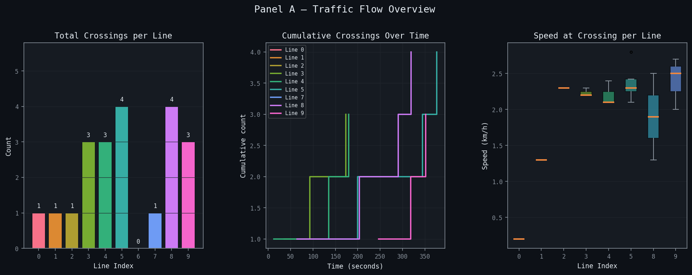
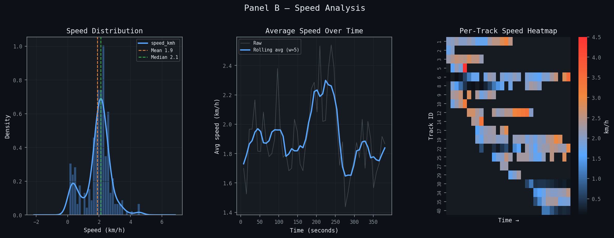
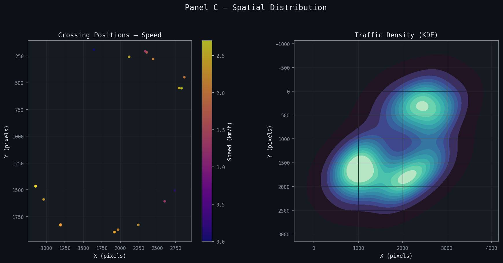
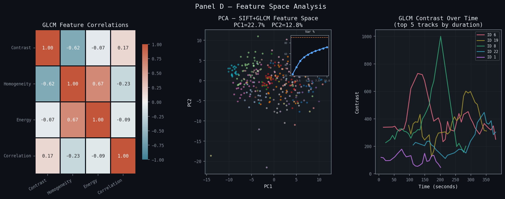

# Traffic Vision Analytics

A comprehensive traffic analysis system that uses YOLO-based vehicle detection and ByteTrack to monitor, track, and analyze vehicular traffic patterns from drone footage.

## Overview

This project processes drone video footage to extract detailed traffic metrics including:

- **Vehicle Detection & Tracking**: Real-time detection of cars, motorcycles, buses, and trucks using YOLOv8
- **Traffic Flow Analysis**: Count vehicles crossing predefined detection lines
- **Speed Estimation**: Calculate vehicle velocities using pixel-to-meter calibration
- **Spatial Heatmaps**: Visualize traffic concentration zones
- **Feature Extraction**: Deep feature analysis using SIFT descriptors and GLCM texture properties

## Key Features

🎯 **Advanced Tracking**

- ByteTrack multi-object tracking for consistent vehicle identification
- Track history buffer with configurable persistence
- Graph-cut refinement for improved detection quality

🔍 **Computer Vision Pipeline**

- Wavelet denoising for improved video quality
- SIFT feature extraction for vehicle characterization
- GLCM (Gray-Level Co-occurrence Matrix) texture analysis
- Configurable detection thresholds and matching parameters

📊 **Analytics Dashboard**

- Flow analysis panel showing traffic crossing counts
- Speed distribution visualization
- Spatial traffic concentration heatmaps
- Feature space dimensionality reduction (PCA)

## Project Structure

```
traffic-analysis/
├── infer.py                          # Main inference pipeline
├── visualize.py                      # Analytics dashboard generator
├── custom_tracker.yml                # ByteTrack configuration
├── assets/
│   └── drone-footage.mp4             # Input video file
├── models/
│   ├── yolo26m.pt                    # YOLOv8 Medium model
│   └── yolo26s.pt                    # YOLOv8 Small model
└── analysis/
    └── [session_id]/
        ├── annotated.mp4             # Output video with annotations
        ├── summary.json              # Analysis metadata
        ├── crossings.csv             # Line crossing events
        ├── speeds.csv                # Speed estimates
        ├── features.csv              # Extracted feature vectors
        ├── heatmap.png               # Traffic density heatmap
        └── plots/                    # Analysis visualizations
```

## Analysis Results

Latest analysis session: **20260430_162605**

### Statistics

- **Total Frames**: 518
- **Video Duration**: 385.63 seconds (~6.4 minutes)
- **Processing Speed**: 1.34 fps
- **Spatial Calibration**: 21.644 pixels per meter
- **Total Vehicles Tracked**: 21 unique vehicles

### Traffic Crossing Summary

Line-by-line crossing counts across 10 detection lines:

- Line 0: 1 crossing
- Line 1: 1 crossing  
- Line 2: 1 crossing
- Line 3: 3 crossings
- Line 4: 3 crossings
- Line 5: 4 crossings
- Line 6: 0 crossings (inactive)
- Line 7: 1 crossing
- Line 8: 4 crossings
- Line 9: 3 crossings

**Total Crossings**: 21 vehicles across all monitoring lines

## Analysis Visualizations

### Panel A: Traffic Flow Analysis



Shows cumulative vehicle counts crossing each detection line over time, revealing traffic patterns and flow intensity across different monitoring zones.

### Panel B: Speed Distribution



Visualizes the distribution of vehicle speeds across the monitored area, showing average velocities and speed variations for each detection line.

### Panel C: Spatial Traffic Concentration



Heatmap displaying traffic density and concentration patterns, revealing hotspots and traffic-prone areas within the monitored zone.

### Panel D: Feature Space Analysis



PCA projection of vehicle feature vectors showing the distribution of vehicles in extracted feature space (SIFT + GLCM texture features), useful for vehicle classification and anomaly detection.

## Annotated Video

The output video with real-time vehicle detection, tracking, and line crossing annotations:

[**View Annotated Video**](./analysis/20260430_162605/annotated.mp4)

This video shows:
- Bounding boxes around detected vehicles
- Unique track IDs for each vehicle
- Detection line overlays for crossing monitoring
- Real-time traffic flow visualization

## Usage

### Running the Inference Pipeline

1. **Place your video file** at `./assets/drone-footage.mp4`

2. **Run the detection and tracking**:

   ```bash
   python infer.py
   ```

   This will:
   - Detect and track vehicles in the video
   - Save results to a timestamped session directory
   - Generate crossing events, speeds, and features
   - Create an annotated output video

3. **Generate the analytics dashboard**:

   ```bash
   # Auto-detect latest session
   python visualize.py
   
   # Or specify a session
   python visualize.py --session 20260430_162605
   
   # Save plots as PNG instead of displaying
   python visualize.py --session 20260430_162605 --save
   ```

### Configuration

Edit `custom_tracker.yml` to adjust tracking parameters:

```yaml
tracker_type: bytetrack              # Tracking algorithm
track_high_thresh: 0.5               # Initial association threshold
track_low_thresh: 0.1                # Secondary association threshold
new_track_thresh: 0.6                # New track creation threshold
track_buffer: 30                     # Frames to retain lost tracks
match_thresh: 0.8                    # Track matching threshold
fuse_score: True                     # Fuse detection scores with IOU
gating_threshold: 0.8                # Distance-based filtering threshold
```

### Customizing Detection Parameters

In `infer.py`, modify these constants:

```python
VIDEO_PATH      = "./assets/drone-footage.mp4"  # Input video
MODEL_PATH      = "./models/yolo26m.pt"         # YOLO model
VEHICLE_CLASSES = [2, 3, 5, 7]                  # Car, motorbike, bus, truck
TRACK_HISTORY   = 30                            # Frames per track
GRAPHCUT_EVERY  = 5                             # Graph-cut frequency
HEATMAP_RADIUS  = 20                            # Heatmap blob size
```

## Output Formats

### summary.json

Metadata about the analysis session including video properties, pixel-to-meter calibration, and crossing counts.

### crossings.csv

Detailed event log of vehicle crossings with timestamps and line IDs.

### speeds.csv

Speed estimates for each tracked vehicle including spatial coordinates and temporal information.

### features.csv

High-dimensional feature vectors for each vehicle combining:

- SIFT descriptors (128-dimensional)
- GLCM texture properties (4-dimensional)

## Technical Details

### Vehicle Detection

- **Model**: YOLOv8 (Medium variant for speed/accuracy balance)
- **Tracked Classes**: Car (2), Motorcycle (3), Bus (5), Truck (7)
- **Confidence Threshold**: 0.5

### Preprocessing

- Wavelet denoising (Daubechies-1, level 2) for noise reduction
- Maintains luminance channel integrity

### Tracking Algorithm

- **ByteTrack**: Efficient multi-object tracking with Kalman filtering
- **Association**: Hungarian algorithm with IoU and feature distance metrics
- **Track Management**: Configurable buffer for temporary occlusions

### Feature Extraction

- **SIFT**: Rotation-invariant keypoint descriptors (128-dim)
- **GLCM**: Gray-level co-occurrence matrix texture features
  - Contrast, Homogeneity, Energy, Correlation

## Dependencies

- Python 3.8+
- PyTorch
- Ultralytics YOLOv8
- OpenCV (cv2)
- scikit-image (for GLCM)
- PyWavelets (pywt)
- NumPy, Pandas
- Matplotlib, Seaborn
- scikit-learn (for PCA)

Install with:

```bash
pip install torch ultralytics opencv-python scikit-image PyWavelets numpy pandas matplotlib seaborn scikit-learn cvzone
```

## License

This project analyzes traffic patterns for research and operational purposes. Ensure compliance with local privacy regulations regarding video surveillance and vehicle tracking.

## Author

Traffic Vision Analytics — Drone-based traffic monitoring system
